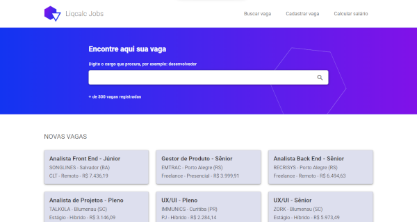

# Liqcalc Jobs

Um site de vagas que possui uma calculadora de salário líquido com base nas alíquotas da previdência e IR. Na tela inicial poderá realizar uma busca ou conferir as últimas vagas cadastradas. Haverá também uma tela para busca com filtros, a fim de trazer resultados mais específicos. Também poderá registrar uma nova oportunidade. Além disso, o site contará com uma calculadora que mostra os descontos no modelo CLT e o salário líquido resultante.

Acesse a prévia do projeto em: [https://liqcalc-jobs.vercel.app/](https://liqcalc-jobs.vercel.app).

Tecnologias utilizadas: **Angular**, Typescript, HTML e CSS.

Autor: Maurício J. Gomes  
Contato: maur.gomes@gmail.com  
Linkedin: [https://www.linkedin.com/in/mauriciojgomes/](https://www.linkedin.com/in/mauriciojgomes/)

## Roadmap

- Redesenho da calculadora de salário líquido
- Tela de busca de vagas com filtros
- Tela de detalhamento da vaga
- Tela de cadastro de vagas

## Rodar localmente

Rode o `ng serve` para o servidor da aplicação e também `npm run json-start` para o servidor de json que simula a api.

Abra o endereço `http://localhost:4200/` para abrir na aplicação.

## Libs utilizadas

- @angular/material - https://material.angular.io/
- json-server - https://www.npmjs.com/package/json-server
- @uiowa/digit-only - https://www.npmjs.com/package/@uiowa/digit-only/v/1.1.1